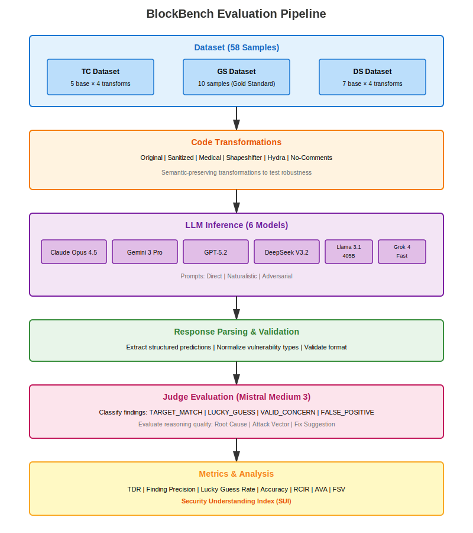

# BlockBench Evaluation Framework

A comprehensive benchmarking system for evaluating Large Language Models (LLMs) on smart contract vulnerability detection tasks.

## Table of Contents

1. [Overview](#overview)
2. [Quick Start](#quick-start)
3. [Dataset](#dataset)
4. [Evaluation Pipeline](#evaluation-pipeline)
5. [Metrics](#metrics)
6. [Running Evaluations](#running-evaluations)
7. [Visualization & Analysis](#visualization--analysis)
8. [Project Structure](#project-structure)
9. [Key Findings](#key-findings)
10. [Citation](#citation)

---

## Overview

BlockBench is a rigorous evaluation framework designed to test LLMs' ability to detect vulnerabilities in smart contracts. The framework evaluates models across:

- **6 frontier LLMs**: Claude Opus 4.5, Gemini 3 Pro, GPT-5.2, DeepSeek V3.2, Llama 3.1 405B, Grok 4 Fast
- **58 smart contract samples** across 3 datasets
- **6 code transformations** testing robustness to semantic-preserving changes
- **3 prompt strategies** evaluating adaptability to different communication styles

### Key Features

- **Multi-dimensional evaluation**: Target Detection Rate, Finding Precision, Lucky Guess Rate, Reasoning Quality
- **Adversarial transformations**: Medical domain mapping, shapeshifting, sanitization
- **Automated judge**: Mistral Medium 3 evaluates all model responses for consistency
- **Publication-ready visualizations**: Matplotlib and Plotly charts suitable for research papers

---

## Quick Start

### 1. Install Dependencies

```bash
# Core evaluation dependencies
pip install -r requirements.txt

# Visualization dependencies
pip install -r requirements_viz.txt

# Or install matplotlib separately
pip install matplotlib
```

### 2. Configure API Keys

Set up your LLM provider API keys:

```bash
export ANTHROPIC_API_KEY="your-claude-key"
export GOOGLE_APPLICATION_CREDENTIALS="/path/to/gemini-credentials.json"
export OPENAI_API_KEY="your-openai-key"
# ... etc for other providers
```

### 3. Run a Sample Evaluation

```bash
# Evaluate a single model on all samples
python -m src.cli evaluate --model claude_opus_4.5 --prompt-type direct

# Run judge evaluation
python -m src.cli judge --model claude_opus_4.5

# Generate visualizations
python generate_matplotlib_charts.py
```

---

## Dataset

BlockBench consists of **58 total samples** spanning **22 unique vulnerabilities** across 3 subsets:

### Dataset Composition

| Subset | Description | Samples | Transformations | Purpose |
|--------|-------------|---------|-----------------|---------|
| **TC** (Temporal Contamination) | Recent vulnerabilities (2023-2024) likely in training data | 5 base × 4 transforms = 20 | Sanitized, Medical, Shapeshifter, Hydra | Test if models memorized exploits |
| **GS** (Gold Standard) | Professional audit findings from security firms | 10 samples (all sanitized) | Sanitized only | High-quality ground truth |
| **DS** (DiverseVul) | Diverse vulnerability types from academic dataset | 7 base × 4 transforms = 28 | Sanitized, Medical, Shapeshifter, Hydra | Broad coverage |

### Code Transformations

1. **Original (No-Comments)**: Original vulnerable code with comments removed
2. **Sanitized**: Variable/function names replaced with generic identifiers (e.g., `var1`, `func2`)
3. **Medical Domain (Chameleon)**: Identifiers mapped to medical terminology (e.g., `patient`, `diagnosis`)
4. **Shapeshifter L3**: Medium complexity code restructuring preserving semantics
5. **Hydra Restructure**: Significant structural changes (loops, conditionals)
6. **No-Comments + Variants**: Clean baseline versions

### Vulnerability Types Covered

- Reentrancy
- Access Control
- Integer Overflow/Underflow
- Unchecked External Calls
- Front-Running
- Timestamp Dependence
- Denial of Service
- Price Manipulation
- Improper Validation
- Authentication Bypass
- Uninitialized State Variables

### Sample File Structure

```
samples/
├── contracts/           # Smart contract source files (.sol)
│   ├── nc_o_tc_001.sol              # Original TC sample
│   ├── sanitized_tc_001.sol         # Sanitized version
│   ├── ch_medical_nc_tc_001.sol     # Medical transformation
│   └── ...
├── ground_truth/        # Vulnerability labels and metadata
│   └── {sample_id}.json
└── manifest.json        # Dataset configuration
```

---

## Evaluation Pipeline

### Architecture



The evaluation pipeline consists of 5 stages:

1. **Dataset** → Smart contracts with transformations
2. **Transformations** → Semantic-preserving code modifications
3. **LLM Inference** → 6 frontier models analyze contracts
4. **Response Parsing** → Extract and validate structured predictions
5. **Judge Evaluation** → Mistral Medium 3 classifies findings
6. **Metrics** → Compute TDR, Precision, Lucky Guess, SUI, etc.

### Pipeline Stages

#### 1. **Model Inference** (`src/pipeline/runner.py`)

Models receive:
- **Input**: Smart contract source code + prompt
- **Prompt types**:
  - `direct`: Structured JSON output with explicit vulnerability analysis
  - `naturalistic`: Colleague-style review request (free-form)
  - `adversarial`: "Already audited" framing (tests sycophancy)
- **Output**: Vulnerability verdict + findings + confidence

#### 2. **Response Parsing** (`src/prompts/parser.py`)

- Extract structured data from model responses
- Handle JSON parsing errors
- Normalize vulnerability types
- Validate response format

#### 3. **Judge Evaluation** (`src/judge/runner.py`)

Mistral Medium 3 evaluates each model finding:

- **Target Match**: Does finding identify the ground truth vulnerability?
- **Lucky Guess**: Identifies wrong vulnerability but gets verdict correct?
- **Valid Concern**: Is the identified issue a real security concern?
- **False Positive**: Invalid or non-existent vulnerability?

#### 4. **Metric Computation** (`src/judge/metrics.py`)

Aggregates judge verdicts into comprehensive metrics (see [Metrics](#metrics) section).

---

## Metrics

BlockBench uses a multi-dimensional evaluation framework:

### Core Detection Metrics

| Metric | Formula | Description |
|--------|---------|-------------|
| **Target Detection Rate (TDR)** | `# Target Matches / # Vulnerable Samples` | % of ground truth vulnerabilities correctly identified |
| **Finding Precision** | `# Valid Findings / # Total Findings` | % of reported vulnerabilities that are real issues |
| **Accuracy** | `(TP + TN) / Total` | Overall correctness of vulnerable/not vulnerable verdicts |
| **Lucky Guess Rate** | `# Lucky Guesses / # Detections` | % of "correct" verdicts that found wrong vulnerability |

### Reasoning Quality Metrics

| Metric | Description | Scale |
|--------|-------------|-------|
| **RCIR** (Root Cause Identification Rate) | Does model explain root cause correctly? | 0-1 |
| **AVA** (Attack Vector Accuracy) | Does model describe realistic attack scenario? | 0-1 |
| **FSV** (Fix Suggestion Validity) | Is suggested mitigation appropriate? | 0-1 |

### Composite Score

**Security Understanding Index (SUI)**:
```
SUI = (TDR × 0.4) + (Finding Precision × 0.4) + (Accuracy × 0.2)
```

Higher weight on detection and precision vs. overall accuracy.

### Example Metrics Breakdown

```json
{
  "tdr": 0.263,                    // 26.3% of vulnerabilities found
  "finding_precision": 0.500,       // 50% of findings are valid
  "accuracy": 0.368,                // 36.8% overall accuracy
  "lucky_rate": 0.625,              // 62.5% of detections were lucky guesses
  "sui": 0.379                      // Composite score: 37.9%
}
```

---

## Running Evaluations

### Evaluate Models

```bash
# Single model, single prompt type
python -m src.cli evaluate \
  --model claude_opus_4.5 \
  --prompt-type direct

# Multiple prompt types
python -m src.cli evaluate \
  --model gemini_3_pro_preview \
  --prompt-type direct,naturalistic,adversarial

# All models in parallel (caution: expensive!)
python -m src.cli evaluate \
  --model all \
  --prompt-type direct \
  --max-workers 6
```

### Run Judge Evaluation

```bash
# Judge a specific model's outputs
python -m src.cli judge --model claude_opus_4.5

# Judge with custom concurrency (to avoid rate limits)
python scripts/judge_new_prompts.py  # Sequential evaluation
```

### Custom Scripts

#### Judge Only Specific Prompts

For targeted evaluation (e.g., only naturalistic/adversarial prompts):

```bash
python scripts/judge_new_prompts.py
```

This script:
- Evaluates only specified samples and prompt types
- Runs models sequentially to avoid quota issues
- Resumes from checkpoints if interrupted

#### Analyze Results

```bash
# Generate transformation analysis
python scripts/analyze_by_transformation.py

# Generate Gold Standard performance summary
python scripts/analyze_gs_performance.py
```

---

## Visualization & Analysis

### Generate Charts

#### Matplotlib Charts (Recommended for Papers)

```bash
python chart_generation/generate_matplotlib_charts.py
```

**Outputs**:
- `matplotlib_fig1_performance.{png,pdf}` - Model performance on Gold Standard dataset
- `matplotlib_fig2_lucky_guess.{png,pdf}` - TDR vs Lucky Guess scatter plot

**Features**:
- Large, readable fonts (12-16pt)
- 300 DPI PNG for high-quality printing
- Vector PDF for LaTeX/Word
- Professional matplotlib styling

#### Additional Publication Charts

```bash
python chart_generation/generate_charts_paper.py
```

**Outputs** (8 figures):
1. Model Performance Comparison (SUI ranking)
2. TDR Across Transformations (line graph)
3. Transformation Impact Heatmap
4. TDR vs Finding Precision
5. Prompt Type Impact
6. Performance Components (grouped bar)
7. TDR vs Lucky Guess Rate
8. Sanitization Effect Slope

#### Model Response Comparison

```bash
python chart_generation/generate_model_comparison_chart.py
```

Shows side-by-side how different models analyzed the same vulnerable contract (Nomad Bridge exploit).

### Interactive Visualizations

```bash
jupyter notebook chart_generation/visualization_notebook.ipynb
```

Explore interactive Plotly charts with hover details, zoom, and pan.

### Analysis Reports

Pre-generated markdown reports in `docs/analysis/`:

- **`docs/analysis/TRANSFORMATION_IMPACT_ANALYSIS.md`** - How transformations affect each model
- **`docs/analysis/GS_PERFORMANCE_SUMMARY.md`** - Performance on Gold Standard dataset
- **`docs/analysis/PROMPT_TYPE_RESULTS.md`** - Comparison of prompt strategies
- **`docs/analysis/DATASET_SUMMARY.md`** - Complete dataset breakdown
- **`docs/analysis/METHODOLOGY.md`** - Detailed evaluation methodology
- **`docs/analysis/METRICS.md`** - Comprehensive metrics documentation

---

## Project Structure

```
evaluation/
├── README.md                          # This file
├── architecture.svg                   # Pipeline architecture diagram
├── requirements.txt                   # Core dependencies
├── requirements_viz.txt               # Visualization dependencies
│
├── docs/                              # Documentation
│   └── analysis/                      # Analysis reports
│       ├── METHODOLOGY.md             # Evaluation methodology
│       ├── METRICS.md                 # Metrics documentation
│       ├── TRANSFORMATION_IMPACT_ANALYSIS.md
│       ├── GS_PERFORMANCE_SUMMARY.md
│       ├── PROMPT_TYPE_RESULTS.md
│       └── DATASET_SUMMARY.md
│
├── samples/                           # Dataset
│   ├── contracts/                     # Smart contract files (.sol)
│   ├── ground_truth/                  # Vulnerability labels
│   └── manifest.json                  # Dataset configuration
│
├── src/                               # Core framework
│   ├── cli.py                         # Command-line interface
│   ├── data/
│   │   ├── schema.py                  # Data models
│   │   └── sample_loader.py           # Load samples from manifest
│   ├── models/
│   │   ├── base.py                    # Base model interface
│   │   ├── anthropic_model.py         # Claude integration
│   │   ├── gemini_model.py            # Gemini integration
│   │   ├── openai_model.py            # GPT integration
│   │   └── ...                        # Other model integrations
│   ├── prompts/
│   │   ├── templates.py               # Prompt templates
│   │   └── parser.py                  # Response parsing
│   ├── pipeline/
│   │   └── runner.py                  # Evaluation orchestration
│   └── judge/
│       ├── runner.py                  # Judge evaluation
│       ├── prompts.py                 # Judge prompt templates
│       └── metrics.py                 # Metric computation
│
├── output/                            # Model predictions
│   ├── claude_opus_4.5/
│   │   ├── direct/                    # Direct prompt responses
│   │   ├── naturalistic/              # Naturalistic responses
│   │   └── adversarial/               # Adversarial responses
│   └── ...                            # Other models
│
├── judge_output/                      # Judge evaluations
│   ├── claude_opus_4.5/
│   │   ├── judge_outputs/             # Individual judge verdicts
│   │   ├── sample_metrics/            # Per-sample metrics
│   │   ├── aggregated_metrics.json    # Overall metrics
│   │   └── summary_report.md          # Human-readable summary
│   └── ...
│
├── charts/                            # Generated visualizations
│   ├── matplotlib_fig1_performance.{png,pdf}
│   ├── matplotlib_fig2_lucky_guess.{png,pdf}
│   ├── paper_fig1_performance.{html,png,pdf}
│   └── ...
│
├── chart_generation/                  # Visualization scripts
│   ├── generate_matplotlib_charts.py  # Matplotlib chart generator
│   ├── generate_charts_paper.py       # Publication chart generator (Plotly)
│   ├── generate_charts_elegant.py     # Elegant charts with model branding
│   ├── generate_charts.py             # Original charts
│   ├── generate_model_comparison_chart.py # Model comparison chart
│   ├── visualization_notebook.ipynb   # Interactive Jupyter notebook
│   └── VISUALIZATION_README.md        # Visualization documentation
│
├── scripts/                           # Analysis scripts
│   ├── analyze_by_transformation.py   # Transformation analysis
│   ├── analyze_gs_performance.py      # Gold Standard analysis
│   └── judge_new_prompts.py           # Targeted judge evaluation
│
└── archive/                           # Archived/temporary files
    ├── regenerate_gemini.py           # Gemini-specific regeneration
    ├── manifest_temp_gemini.json      # Temporary manifest
    └── find_interesting_sample.py     # Helper script
```

---

## Key Findings

### Overall Performance Rankings

**Security Understanding Index (SUI) on Gold Standard Dataset**:

1. **Gemini 3 Pro**: 40.0% (Best TDR: 26.3%, but high lucky guess rate)
2. **Claude Opus 4.5**: 39.8% (Balanced performance)
3. **GPT-5.2**: 37.9% (Lowest lucky guess rate: 37.5%)
4. **DeepSeek V3.2**: 33.8%
5. **Grok 4 Fast**: 30.1%
6. **Llama 3.1 405B**: 26.7% (Highest lucky guess rate: 90.9%)

### Critical Insights

#### 1. The Sanitization Catastrophe

All models suffer **40-60 percentage point drops** in TDR when code is sanitized:

- **Original code**: 60-85% TDR
- **Sanitized code**: 5-32% TDR

**Implication**: Models heavily rely on semantic cues (variable names, comments) rather than true code understanding.

#### 2. The Lucky Guess Problem

Most "detections" find the **wrong vulnerability**:

- **Llama 3.1 405B**: 90.9% lucky guess rate (finds wrong vuln 9/10 times)
- **GPT-5.2**: 37.5% (best at finding correct vulnerability)

**Implication**: High detection rates may be misleading without examining finding precision.

#### 3. Prompt Strategy Impact

Adversarial prompting ("already audited, double-check") reduces detection:

- **Direct prompt**: 20-30% TDR
- **Naturalistic prompt**: 15-25% TDR
- **Adversarial prompt**: 10-20% TDR

**Implication**: Models exhibit sycophancy, deferring to stated priors.

#### 4. Medical Domain Mapping (Chameleon Attack)

Domain transformation maintains **~70-80% of original TDR**:

- Models can partially generalize across semantic contexts
- But still worse than original code

#### 5. Model-Specific Strengths

- **Claude Opus 4.5**: Most detailed explanations, best reasoning quality (RCIR: 0.85)
- **Gemini 3 Pro**: Highest detection rate but prone to false positives
- **GPT-5.2**: Best precision (lowest lucky guess rate)
- **Llama 3.1 405B**: Struggles with complex vulnerabilities, misses subtle issues

---

## Configuration

### Model Configuration (`src/models/`)

Add new models by implementing the `BaseModel` interface:

```python
class YourModel(BaseModel):
    async def predict(self, sample: Sample, prompt_type: str) -> ModelResponse:
        # Your inference logic
        pass
```

### Prompt Templates (`src/prompts/templates.py`)

Customize prompts for different evaluation scenarios:

- **Direct**: Structured JSON output
- **Naturalistic**: Colleague review style
- **Adversarial**: Sycophancy test

### Judge Configuration (`src/judge/`)

Modify judge prompts or evaluation criteria in `src/judge/prompts.py`.

---

## Troubleshooting

### Common Issues

#### 1. API Rate Limits

**Error**: `429 Too Many Requests`

**Solution**:
```bash
# Run judge sequentially
python scripts/judge_new_prompts.py  # Has max_concurrency=1

# Or reduce concurrency in runner
runner = ModelRunner(max_concurrency=1)
```

#### 2. Parsing Errors

**Error**: `JSON parsing failed`

**Check**: Model response format in `output/{model}/{prompt_type}/r_{sample_id}.json`

Models should return structured JSON. If free-form text, ensure judge can extract findings.

#### 3. Missing Dependencies

**Error**: `ModuleNotFoundError: No module named 'matplotlib'`

**Solution**:
```bash
pip install matplotlib plotly pandas numpy kaleido
```

#### 4. Chart Generation Fails

**Error**: `Failed to export image`

**Solution**:
```bash
# Install kaleido for static exports
pip install kaleido

# Or use matplotlib instead
python generate_matplotlib_charts.py
```

---

## Extending the Framework

### Add New Dataset Samples

1. Add contract to `samples/contracts/{sample_id}.sol`
2. Create ground truth in `samples/ground_truth/{sample_id}.json`:

```json
{
  "sample_id": "your_sample_001",
  "vulnerability_type": "reentrancy",
  "is_vulnerable": true,
  "severity": "critical",
  "description": "Reentrancy in withdraw function...",
  "location": "line 42-50"
}
```

3. Update `samples/manifest.json`:

```json
{
  "samples": [
    {
      "id": "your_sample_001",
      "transformed_id": "your_sample_001",
      "subset": "custom",
      "transformation": "original"
    }
  ]
}
```

### Add New Transformations

Implement transformation in `scripts/transform_code.py`:

```python
def your_transformation(code: str) -> str:
    # Your transformation logic
    return transformed_code
```

### Add Custom Metrics

Extend `src/judge/metrics.py`:

```python
def compute_your_metric(judge_outputs: List[JudgeOutput]) -> float:
    # Your metric computation
    return score
```

---

## Performance Benchmarks

### Inference Costs (Direct Prompt, 58 samples)

| Model | Total Cost (USD) | Avg Cost/Sample | Avg Latency (s) |
|-------|------------------|-----------------|-----------------|
| Claude Opus 4.5 | $3.52 | $0.061 | 15.3 |
| Gemini 3 Pro | $0.26 | $0.005 | 29.3 |
| GPT-5.2 | $1.16 | $0.020 | 24.0 |
| DeepSeek V3.2 | $0.08 | $0.001 | 18.5 |
| Llama 3.1 405B | $0.03 | $0.0004 | 26.6 |
| Grok 4 Fast | $0.15 | $0.003 | 12.1 |

### Judge Evaluation Costs

- **Mistral Medium 3**: ~$0.002 per finding
- **Total judge cost** (all models, all samples): ~$5-10

---

## Citation

If you use BlockBench in your research, please cite:

```bibtex
@misc{blockbench2025,
  title={BlockBench: A Comprehensive Benchmark for Evaluating LLMs on Smart Contract Vulnerability Detection},
  author={Your Name and Contributors},
  year={2025},
  note={Datasets: TC (Temporal Contamination), GS (Gold Standard), DS (DiverseVul)},
  url={https://github.com/yourusername/blockbench}
}
```

---

## License

[Specify your license here]

---

## Contributing

Contributions welcome! Please:

1. Fork the repository
2. Create a feature branch (`git checkout -b feature/amazing-feature`)
3. Commit your changes (`git commit -m 'Add amazing feature'`)
4. Push to the branch (`git push origin feature/amazing-feature`)
5. Open a Pull Request

---

## Acknowledgments

- **Datasets**: TC samples from recent exploits, GS from professional audits, DS from DiverseVul
- **Code transformations**: Chameleon, Shapeshifter, Hydra techniques
- **Judge model**: Mistral Medium 3 via Google Vertex AI

---

## Contact

For questions or issues, please open a GitHub issue or contact [your-email@example.com].

---

**Last Updated**: December 2025
